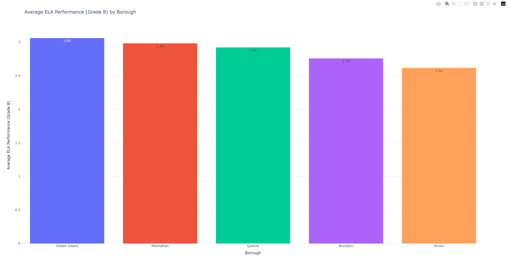
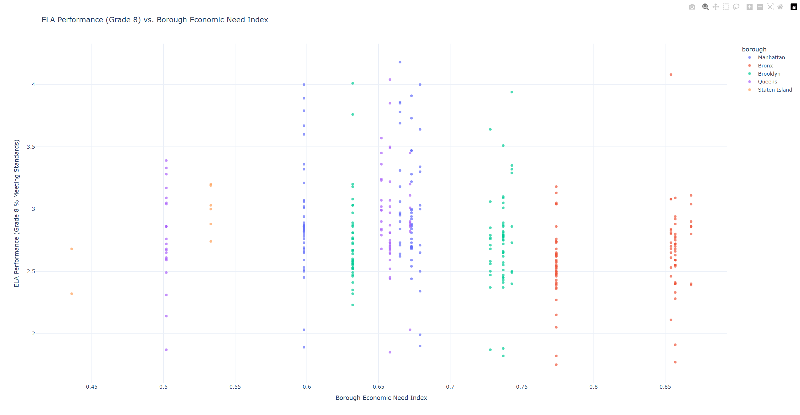
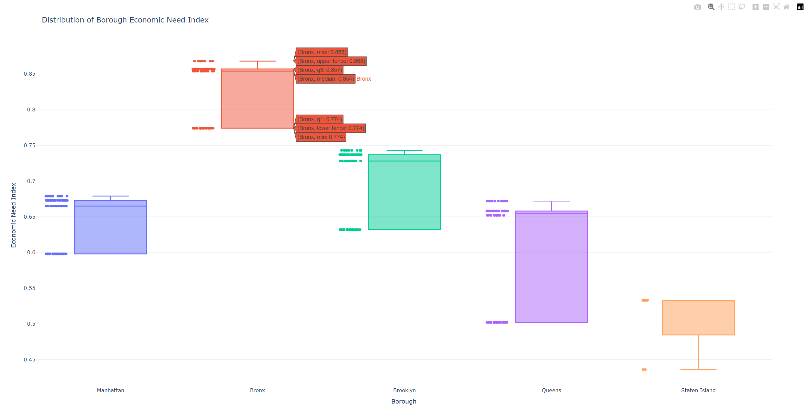
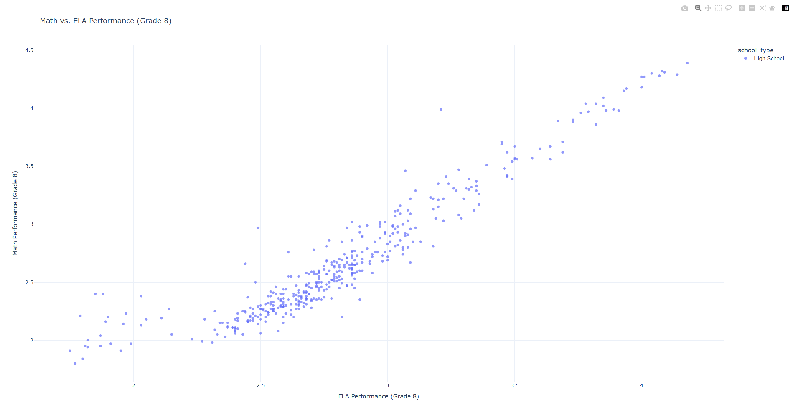
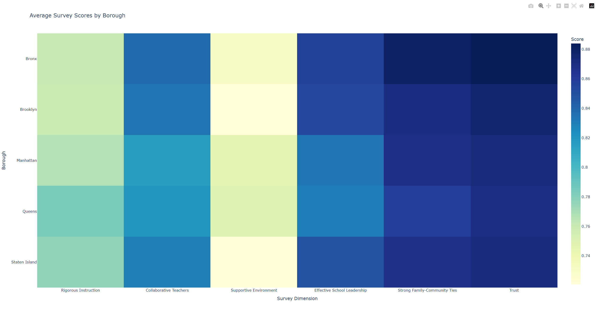
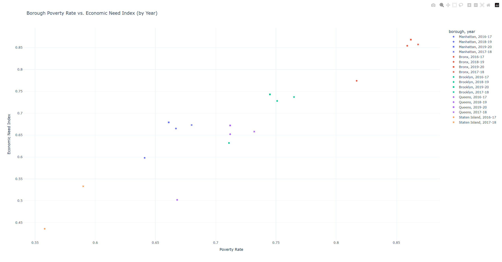

# NYC Public School Performance Data Integration and Visualization

This project integrates publicly available NYC public school performance data from the [NYC Open Data](https://opendata.cityofnewyork.us/) API, merges school-level quality review data with borough-level demographics, and produces interactive visualizations using Python.

## Key Features

- **Paginated API fetching** — retrieves all records from Socrata endpoints
- **District-to-borough mapping** — maps school DBN codes to NYC boroughs
- **School year derivation** — extracts academic year from quality review dates
- **Borough-level enrichment** — merges school performance with borough demographics (enrollment, poverty rate, economic need index, racial demographics)
- **Numeric type conversion** — ensures all quantitative fields are properly typed
- **6 interactive Plotly visualizations** including scatter plots, bar charts, box plots, heatmaps

## Project Structure
```
NYC-Public-School-Performance-Data-Integration-and-Visualization/
├── data/
│   ├── raw/
│   │   ├── school_demographics.json   # Borough-level demographics (25 records)
│   │   └── school_performance.json    # School-level quality reviews (485 records)
│   └── processed/
│       └── merged_school_data.csv     # Merged dataset (421 schools, 70 columns)
├── notebooks/
│   └── data_integration_and_visualization.ipynb
├── src/
│   ├── data_acquisition.py            # API fetching with pagination
│   └── data_processing.py             # Cleaning, mapping, merging
├── requirements.txt
└── README.md
```

## Data Sources

- **School Demographics** (school-level, 2017–2022): https://data.cityofnewyork.us/resource/c7ru-d68s.json
  - Per-school enrollment, poverty rates, economic need index, racial/ethnic demographics (9,251 records, 1,882 schools)
- **School Quality Reviews** (school-level, 2014–2020): https://data.cityofnewyork.us/resource/ci36-d7ea.json
  - Individual school survey scores, quality review ratings, ELA/Math performance, enrollment (485 records)

## How It Works

1. **Data Acquisition** fetches all records with automatic pagination from both Socrata API endpoints
2. **Data Processing** maps each school's DBN district code to a borough, derives the school year from review dates, converts all numeric fields (including `%`-formatted values), and performs a direct school-level merge on `dbn + year`
3. **Visualization** creates 6 interactive charts exploring relationships between school performance, economic need, survey quality, and borough demographics

## Setup and Execution

1. **Create & activate virtual environment:**
   ```bash
   python -m venv .venv
   # Windows: .venv\Scripts\activate
   # Linux/Mac: source .venv/bin/activate
   ```

2. **Install dependencies:**
   ```bash
   pip install -r requirements.txt
   ```

3. **Fetch latest data:**
   ```bash
   python src/data_acquisition.py
   ```

4. **Process and merge data:**
   ```bash
   python src/data_processing.py
   ```

5. **Run visualizations:**
   Open `notebooks/data_integration_and_visualization.ipynb` in Jupyter/PyCharm and run all cells.

## Visualizations

| # | Chart                             | Description                                                              |
|---|-----------------------------------|--------------------------------------------------------------------------|
| 1 | Scatter: ELA vs Economic Need     | School ELA performance against borough economic need, colored by borough |
| 2 | Bar: Avg ELA by Borough           | Average Grade 8 ELA performance across boroughs                          |
| 3 | Box: Economic Need by Borough     | Distribution of borough economic need index                              |
| 4 | Scatter: Math vs ELA              | Correlation between math and ELA performance, colored by school type     |
| 5 | Heatmap: Survey Scores            | Average survey dimension scores by borough                               |
| 6 | Scatter: Poverty vs Economic Need | Borough-level poverty rate vs economic need index over time              |

## Skills Demonstrated

- REST API interaction with pagination (Socrata Open Data)
- Data cleaning, type conversion, and domain-specific mapping (DBN → borough)
- Multi-source data integration (many-to-one merge)
- Interactive visualization with Plotly
- Python, Pandas, logging, project organization






